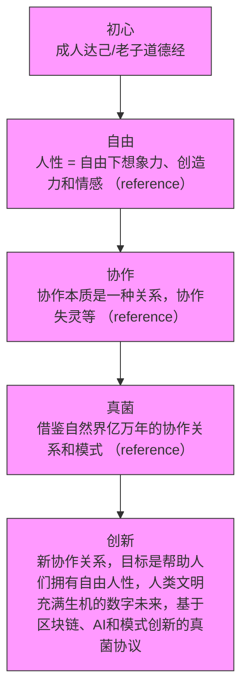
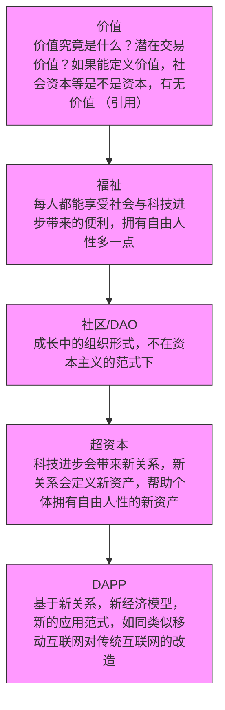

# Roadmap
什么是最重要的？如何筛选和安排，从而实现我们的初心？千头万绪，我们整理了核心的阶段和整体里程碑，并不断更新。

## Phase定义
当下我们没有确切的时间给出，但我们会尝试不断细化。
### Phase 0
完成核心组件：SuperPaymaster V0.1 AirAccount V0.2, OpenPNTs, OpenCards
完成基础Demo：SDK 完成二次签名交易和积分gas sponsor
完成白皮书初稿。
启动协议。
### Phase 1 
开源方式建立系列组件，帮助社区和个体进入区块链：dApps AI工具+中间件+SDSS。
建立初步的小闭环，可以展开更多的场景探索和试验。

### Phase 2
建立协议和经济模型，使用几个dApp进行社会真实应用测试：OpenNest孵化。
找到了一些可持续，可闭环的模式，能够真实使用dApps给普通个体带来福祉。

### Phase 3
建立完整协议，包括经济模型、智能合约、测试网、主网部署、用户教育、社区建设等。
协作更多社区，展开更大范围的探索。

## 初心

## 愿景

