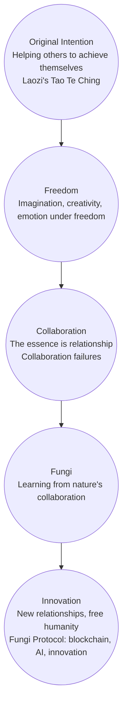
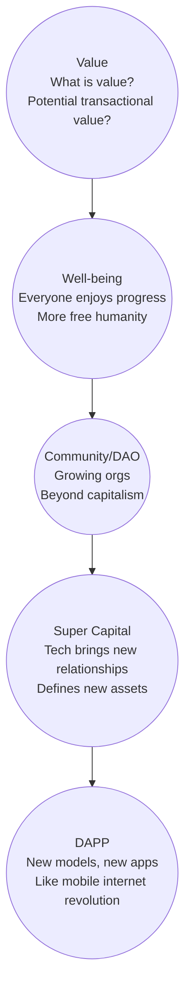

# Roadmap

What is most important? How do we prioritize and arrange tasks to achieve our initial goals? Faced with a multitude of ideas, we have organized the core phases and overall milestones, and will continue to update them.

## Phase Definitions

Currently, we don't have definite timelines to provide, but we will try to refine them continuously.

### Phase 0

Complete core components: SuperPaymaster V0.1, AirAccount V0.2, OpenPNTs, OpenCards.
Complete basic demo: SDK enabling secondary signature transactions and gas sponsorship via points.
Complete the first draft of the whitepaper.
Launch the protocol.

### Phase 1

Establish a series of components through open-source methods to help the community and individuals enter the blockchain space: dApps, AI tools, middleware, and SDSS.
Establish an initial small closed loop, allowing for exploration and experimentation in more scenarios.

### Phase 2

Establish the protocol and economic model, and use several dApps to conduct real-world social application testing: OpenNest incubation.
Identify some sustainable, closed-loop models that can genuinely bring benefits to ordinary individuals through the use of dApps.

### Phase 3

Establish a complete protocol, including the economic model, smart contracts, testnet, mainnet deployment, user education, community building, etc.
Collaborate with more communities to expand exploration on a larger scale.

## Original Intention

## PATH

