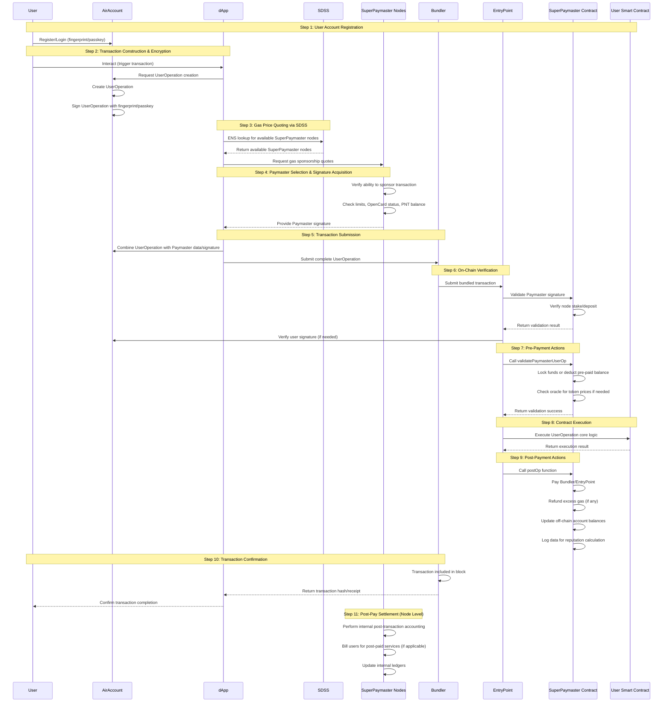
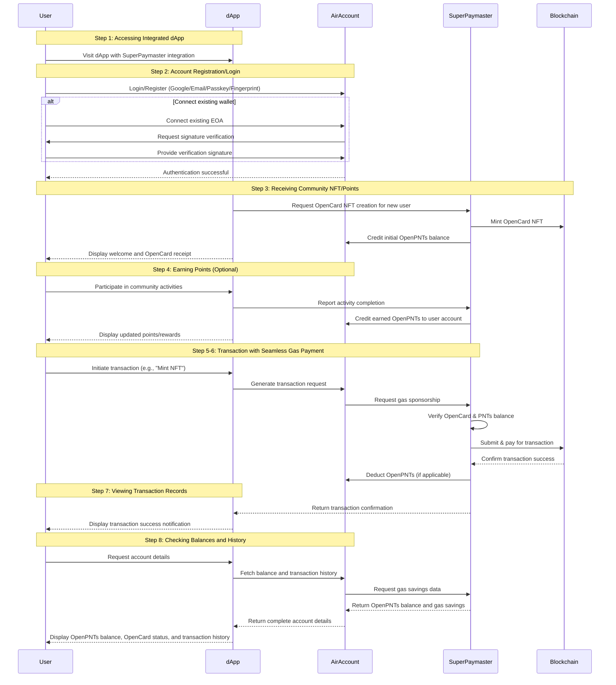

# SuperPaymaster: A Decentralized Ethereum Gas Payment System Based on ERC4337 and Account Abstraction

## Title

SuperPaymaster: A Decentralized Ethereum Gas Payment System Based on ERC4337 and Account Abstraction

## Authors

Huifeng Jiao, Dr. Nathapon Udomlertsakul, Dr. Anukul Tamprasirt, AAStar Team
International College of Digital Innovation, Chiang Mai University, Chiang Mai, 50200, Thailand
E-mail: huifeng_jiao@cmu.ac.th, nathapon.u@icdi.cmu.ac.th, anukul@innova.or.th, hi@aastar.io

## Keywords

**Blockchain, Ethereum, ERC-4337, Account Abstraction, Paymaster, Gas Payment, Decentralized Service System, SDSS**

## Highlights

- We provide a comprehensive overview of existing gas payment systems on the Ethereum blockchain and analyze their inherent weaknesses.
- We establish key guidelines and requirements for the design of a decentralized, seamless, and cost-effective gas payment system.
- We propose a novel gas payment (sponsor) system, leveraging the Ethereum platform and an application sponsorship model to address costly and complex processes.
- We conduct a proof of concept (PoC) to demonstrate the advantages of the proposed system over existing solutions and to outline potential future research directions.

## Abstract
This research utilizing principles of Human-Computer Interaction (HCI) and account abstraction technologies such as ERC-4337, we aim to optimize the gas payment experience on Ethereum (and EVM-compatible chains) to reduce costs, enhance user experience (UX), and improve system efficiency, ultimately facilitating the large-scale adoption of blockchain technology.
This paper introduces SuperPaymaster, a novel blockchain transaction Gas payment system leveraging Account Abstraction (ERC-4337) and a Standardized Decentralized Service System (SDSS) to address critical challenges in current Gas payment solutions, including high costs, poor user experiences, and inefficiencies. Existing blockchain Gas payment mechanisms are user-unfriendly and inconvenient, and while ERC-4337 offers partial improvements, issues like centralization, price monopolization, and censorship persist. Furthermore, current approaches lack fully decentralized Gas payment services, evidenced by limited ERC-20 token acceptance, the absence of permissionless Gas sponsorship, uneven service coverage, and complex application integration. SuperPaymaster proposes an open-source, decentralized framework enabling anyone to register and operate their Paymaster service via the SuperPaymaster contract, accepting any ERC-20 token for Gas. Integrating the AirAccount contract and SuperPaymaster service, underpinned by SDSS utilizing ENS and P2P networks, this system aims to significantly reduce the high time costs of cross-chain transactions and holding Gas tokens. It also seeks to streamline cumbersome procedures, enhance inefficient operations, and improve the poor user experience of existing tools. A Proof-of-Concept (PoC) validates the system's feasibility and advantages.
207 words

##  1. Introduction

<!-- 1.1 Background and Motivation -->

Blockchain technology represents a significant technological advancement with the potential to reshape societal collaboration and digital asset exchange, evidenced by its multi-trillion dollar market capitalization [Optional: Add citation]. However, realizing its full potential for mass adoption hinges critically on user acceptance and experience. Drawing upon the Technology Acceptance Model (TAM) and principles of Human-Computer Interaction (HCI), user adoption is largely determined by perceived usefulness and perceived ease of use [Optional: Add citation for TAM/HCI]. While blockchain offers novel functionalities (usefulness), significant barriers related to usability, efficiency, and cost currently hinder its perceived ease of use and overall user experience, impeding broader acceptance.

<!-- 1.2 Problem Statement -->

A primary obstacle within the current blockchain ecosystem, particularly on platforms like Ethereum and EVM-compatible chains, is the cumbersome and costly process of paying transaction fees, commonly known as "gas". Daily gas consumption on Ethereum alone highlights the economic scale of this friction point [Optional: Cite ultrasound.money]. Users, especially newcomers, face a steep learning curve involving complex concepts, multi-step procedures (often exceeding 10-15 steps involving exchanges, cross-chain transfers, and wallet management), high and volatile costs, and a generally poor user experience. More like high cognitive load, execution/evaluation gulfs in HCI and TAM theory. These usability challenges act as significant deterrents, preventing users from fully engaging with and realizing the value of decentralized applications (dApps).

<!-- 1.3 Research Gap -->

While solutions like Ethereum's Account Abstraction standard (ERC-4337) aim to alleviate some of these issues by enabling features like gas sponsorship (Paymasters), current implementations often fall short [Optional: Add citation for ERC-4337]. Existing approaches frequently rely on centralized relayers (Bundlers) and Paymasters, reintroducing risks of price manipulation, censorship, and single points of failure – counteracting blockchain's core decentralization ethos. Furthermore, limitations persist regarding the flexible use of diverse ERC-20 tokens for gas payments, permissionless service operation, and seamless integration for dApp developers. A critical gap exists in providing a truly decentralized, competitive, and user-friendly gas payment infrastructure that aligns with the open, community-driven nature of blockchain.

<!-- 1.4 Research Objectives and Questions -->

This research aims to design, implement, and evaluate a novel system, SuperPaymaster, built upon ERC-4337 and a proposed Standardized Decentralized Service System (SDSS) architecture, to address the identified gaps in blockchain gas payments. The primary objectives are to significantly reduce gas payment costs through competition, enhance user experience by simplifying interactions (e.g., via NFT-based "Gas Cards" and seamless payments), improve operational efficiency, and mitigate the risks associated with centralized intermediaries.

This study is guided by the following key research questions:

How can a decentralized gas payment system based on ERC-4337 and SDSS effectively reduce transaction costs and improve user experience compared to existing methods?

What mechanisms within this system can mitigate the risks of price monopoly and censorship inherent in centralized gas payment solutions?

How feasible and efficient is the proposed SuperPaymaster system and SDSS architecture in a practical implementation?

<!-- 1.5 Significance and Scope -->

This research contributes a novel, decentralized gas payment solution (SuperPaymaster) and a foundational service architecture (SDSS), offering a viable alternative to centralized approaches. By integrating HCI principles, it directly tackles the usability barriers hindering blockchain adoption, potentially making dApps significantly more accessible. The study's significance lies in its potential to foster a more open, competitive, and user-centric gas payment ecosystem, aligning with blockchain's core values. The scope is focused on gas payment optimization within EVM-compatible chains using ERC-4337, evaluating cost, user experience (usability, cognitive load), efficiency, and decentralization aspects. It does not cover broader account management or non-gas-related security issues.

<!-- 1.6 Brief Methodology and Structure -->

Employing a design science approach, this research involves: (1) Designing the SuperPaymaster system and SDSS architecture. (2) Implementing key components like competitive quoting, NFT Gas Cards, and permissionless node registration. (3) Developing and evaluating a Proof-of-Concept (PoC) on the Ethereum Sepolia testnet using Solidity, Go, and TypeScript. The remainder of this paper is organized as follows: Section 2 reviews related work. Section 3 details the proposed system design. Section 4 presents the evaluation methodology and results. Section 5 discusses the findings and limitations. Section 6 concludes the paper and outlines future work.

## 2. Analysis of Current Gas Payment Systems and Associated Challenges
This section delves into the foundational aspects of gas payment mechanisms within EVM-compatible blockchains, outlines the typical user workflow, and critically examines the multifaceted challenges and vulnerabilities inherent in current systems, including usability barriers and the specific risks associated with centralized solutions.

### 2.1 The Gas Payment Mechanism
#### 2.1.1 Necessity of Gas Payment
The requirement for users to pay 'gas' for transactions is fundamental to the operation and security of public, permissionless blockchains like Ethereum. Due to the Turing-completeness of the Ethereum Virtual Machine (EVM), which allows for arbitrary computation, a mechanism is needed to prevent infinite loops and denial-of-service (DoS) attacks that could exhaust network resources (Wood, 2014, rev. 2022). Gas acts as a computational metering unit, assigning a cost to each operational step executed by the EVM. By requiring payment for computation, the gas mechanism ensures the sustainable use of shared public resources, prevents network abuse, and incentivizes validators (miners/stakers) to process transactions and secure the network (Buterin et al., 2015).

#### 2.1.2 Current Gas Payment Workflow
Executing a transaction on current blockchain systems typically involves a complex, multi-step workflow for the user, even before the core on-chain interaction occurs. A user often needs to: (1) Create an account on a centralized exchange (CEX); (2) Complete Know Your Customer (KYC) verification; (3) Purchase the blockchain's native token (e.g., ETH for Ethereum) using fiat currency; (4) Set up a self-custodial wallet (e.g., MetaMask); (5) Transfer the native token from the CEX to their wallet, incurring withdrawal fees; (6) Potentially perform cross-chain swaps or bridging if operating on a different network or requiring specific tokens, adding further complexity and cost; (7) Finally, initiate the desired transaction (e.g., interacting with a dApp), requiring careful setting of gas parameters (gas limit, gas price/priority fee) and signing with their private key. This intricate process serves as a significant initial barrier, particularly for non-technical users.

### 2.2 Challenges and Vulnerabilities in Current Systems
Existing gas payment systems suffer from a confluence of issues that impede usability, efficiency, and trust.

#### 2.2.1 User Experience Deficiencies
From both HCI and TAM perspectives, current systems exhibit numerous characteristics detrimental to user adoption. They often impose a high cognitive load, demonstrate poor usability across multiple dimensions (detailed in Section 2.3), involve significant direct and indirect costs, necessitate convoluted multi-step processes, offer a subpar overall experience, and raise security concerns for average users [Citation needed - General HCI/Usability reference, e.g., Nielsen Norman Group articles].

#### 2.2.2 Asset Fragmentation
The proliferation of diverse blockchain networks (Layer 1s and Layer 2s) necessitates users holding small balances of different native tokens (e.g., ETH on Ethereum mainnet, ETH on Arbitrum, MATIC on Polygon) simply to pay gas fees on each respective chain. This fragmentation increases user overhead, complicates asset management, and adds significant cumulative costs associated with acquiring and managing these disparate gas tokens [Citation needed - Analysis of multi-chain user costs].

#### 2.2.3 Operational Inefficiency
The multi-step workflow described in 2.1.2 is inherently inefficient. Each step, from CEX onboarding and KYC delays to cross-chain bridge waiting times and transaction confirmation latency, introduces friction and consumes considerable user time and effort. This inefficiency persists even for experienced users, hindering fluid interaction with dApps (Pacheco et al., 2023).

#### 2.2.4 Limitations of Existing Countermeasures
While various solutions aim to improve the gas payment experience (e.g., gas estimation tools, early forms of gas abstraction), they often provide only partial relief. Many still require users to possess native tokens or grapple with underlying complexities. Even emerging standards like ERC-4337, while promising, face adoption hurdles and do not inherently solve all usability or centralization issues in their current implementations [Citation needed - Review of gas optimization techniques/early AA].

#### 2.2.5 Risks of Centralized Gas Payment Services (Overview)
The rise of centralized services offering gas sponsorship (Paymasters) or transaction relaying (Bundlers), often associated with ERC-4337 implementations, introduces a new set of risks that potentially undermine blockchain's core principles. These include security vulnerabilities (e.g., facilitating MEV extraction like sandwich attacks, data breaches), the potential for transaction manipulation or censorship based on the provider's policies or jurisdiction, and the risk of market monopolies leading to inflated costs and reduced innovation (Daian et al., 2020). A detailed analysis follows in Section 2.4. It's paradoxical that permissionless accounts, readily created via ECDSA, often necessitate centralized identification and payment methods to acquire gas for initiating decentralized transactions.

### 2.3 Usability Challenges in Gas Payment: An HCI Perspective
The fundamental challenges outlined previously manifest as significant usability barriers when analyzed through the lens of Human-Computer Interaction (HCI).

#### 2.3.1 Ease of Learning & Complex On-Chain Transaction Process
The process described in Section 2.1.2, often involving 7 to 5 distinct steps for a novice user, presents a formidable learning curve. Each step requires understanding new concepts (e.g., wallets, addresses, gas units, Gwei, transaction finality) and mastering new skills (e.g., securing seed phrases, interacting with CEXs and wallets), drastically hindering the ease with which new users can learn to navigate the system effectively (Nielsen, 2012).

#### 2.3.2 Gulf of Execution
Users often struggle to map their intention (e.g., "send money," "buy an NFT") onto the required sequence of actions demanded by the system. This gap, known as the Gulf of Execution (Norman, 2013), is exacerbated by the need to acquire native tokens beforehand, manage cryptographic keys, and manually configure transaction parameters like gas fees – actions far removed from the user's primary goal and unfamiliar compared to traditional financial interactions.

#### 2.3.3 Gulf of Evaluation
Users frequently encounter difficulties in understanding the system's state and the consequences of their actions, reflecting a wide Gulf of Evaluation (Norman, 2013). The volatility and opacity of gas fees make cost prediction challenging. Feedback on transaction progress is often limited to technical hashes or block explorer links, and reasons for transaction failures can be cryptic, leaving users uncertain about outcomes and how to proceed.

#### 2.3.4 Efficiency Issues
Beyond the sheer number of steps, the time involved in completing the gas payment workflow significantly impacts efficiency. Delays associated with KYC verification, fiat-to-crypto conversions, CEX withdrawal processing, cross-chain bridging, and on-chain transaction confirmation times collectively create a slow and cumbersome experience, hindering rapid or spontaneous interactions with dApps (Pacheco et al., 2023).

#### 2.3.5 Error Rate and Lack of Fault Tolerance
The unforgiving nature of blockchain transactions contributes to a high potential for user error. Sending funds to an incorrect address, selecting the wrong network during transfers, or setting inadequate gas fees can lead to irreversible loss of funds or failed transactions. Current systems generally lack robust error prevention mechanisms or 'undo' functionalities common in other software, offering minimal fault tolerance (Reason, 1990).

#### 2.3.6 Memorization Difficulties
The cognitive burden extends to memorization. Users are expected to securely remember or store complex seed phrases or private keys, differentiate between numerous long, cryptic addresses, and recall specific procedures for different dApps or chains. Wallet interfaces themselves can be complex, further increasing the load on user memory.

#### 2.3.7 User Satisfaction Issues
Cumulatively, the high cognitive load, inefficiency, potential for costly errors, and steep learning curve often lead to user frustration and low satisfaction. While aesthetics and interaction flow also play a role, the fundamental usability hurdles associated with gas payments significantly detract from a positive user experience.

#### 2.3.8 Lack of Supporting Tools and Infrastructure
The blockchain ecosystem often lacks standardized, readily available tools for dApp developers to easily integrate user-friendly gas payment solutions. This forces many dApps to either rely on the often-complex interfaces of external wallets or invest significant resources in building custom, potentially inconsistent, usability layers.

#### 2.3.9 High Cognitive Load
Interacting with blockchain gas systems demands significant mental effort due to the sheer volume of novel technical concepts users must process (e.g., Gas, Gwei, Nonce, block confirmations, smart contracts, MEV). This aligns with Cognitive Load Theory, where excessive extraneous cognitive load (load imposed by the interface and task design) hinders learning and performance (Sweller, 1988).

#### 2.3.10 Low Perceived Ease of Use
Consequently, the initial perception for many potential users is that blockchain systems are inherently complex, expensive, cumbersome, and potentially insecure. This low perceived ease of use, a key factor in the Technology Acceptance Model (Davis, 1989), acts as a major barrier to trial and adoption, regardless of the perceived usefulness of the underlying dApp.

### 2.4 Risk Analysis of Centralized Gas Payment Services
While centralized services aim to simplify gas payments, often leveraging ERC-4337 components like Paymasters, they introduce distinct risks stemming from their centralized nature, bring new risk to make blockchain be centralized.

#### 2.4.1 High Integration Costs and Low Adoption Rate
Integrating proprietary, centralized gas payment solutions can be different solutions and costly for dApp developers, often involving specific SDKs and service agreements. Furthermore, the inherent gas overhead associated with smart contract accounts (required by ERC-4337) compared to simpler EOA transactions can add costs, potentially limiting the adoption of these solutions despite their usability benefits [Citation needed - Analysis of AA gas overhead/integration costs].

#### 2.4.2 Transaction Manipulation Risks
Centralized Bundlers or Paymasters occupy a privileged position in the transaction supply chain. This position can be exploited for Maximal Extractable Value (MEV) through practices like front-running (executing their own transaction based on user's transaction information) or sandwich attacks (bracketing a user's trade with their own buy and sell orders), extracting value at the user's expense (Daian et al., 2020).

#### 2.4.3 Privacy Leakage Risks
These centralized entities aggregate vast amounts of transaction data. This data, potentially linkable to IP addresses or other identifiers, can reveal user behavior patterns and financial activities. There is a risk of this data being leaked through breaches, sold to third parties, or used for surveillance, compromising user privacy.

#### 2.4.4 Legal and Regulatory Compliance Risks
Centralized services are subject to the laws and regulations of the jurisdictions in which they operate. This can lead to censorship, where transactions originating from or destined for certain addresses (e.g., those on sanction lists like OFAC's) are blocked. This dependency on jurisdictional compliance contradicts the permissionless ideal of public blockchains and highlights the irony of needing centralized identity verification (KYC/AML on exchanges) to acquire funds for permissionless transactions.

#### 2.4.5 Limited Gas Token Support
Centralized Paymasters often restrict the types of ERC-20 tokens accepted for gas fee payments, typically favoring major stablecoins or their own platform tokens. This limits user choice, potentially forcing users into additional costly swaps, and hinders the ability of communities to utilize their native tokens for network participation.

#### 2.4.6 Long-term Monopoly and Cost Inflation Risks
The market for centralized relayers and paymasters shows signs of concentration [Citation needed - Market share data, e.g., reports on Flashbots dominance or major paymaster providers]. This concentration creates a risk of oligopolistic or monopolistic behavior, where dominant players could potentially increase fees, reduce service quality, or stifle innovation in the long run due to diminished competitive pressure.

## 3. The Proposed System Overview: SuperPaymaster 1450
Addressing the multifaceted challenges detailed in Section 2 requires a paradigm shift from centralized or simplistic gas payment solutions towards a decentralized, user-centric, and competitive ecosystem. This section introduces SuperPaymaster, a novel system designed to achieve this vision. We first outline the critical requirements for such a system, then provide an overview of SuperPaymaster's architecture and actors, delve into its core components including the foundational Standardized Decentralized Service System (SDSS), explain its trust model, and finally, detail its operational workflows from both system and user perspectives.

### 3.1 Requirements Specification for a Decentralized Gas Payment System
Based on the analysis of existing system limitations and user needs, an ideal decentralized gas payment system must satisfy the following key requirements:

#### 3.1.1 Security Requirements
The system must ensure the integrity of transactions and the security of user funds and transaction data. This includes robust authentication, protection against common blockchain attacks, and secure handling of cryptographic keys and signatures. Integration with secure account systems like AirAccount, potentially utilizing biometric second-factor authentication (D2FA), is crucial.

#### 3.1.2 Privacy Requirements
User transaction data and identities should be protected. Service nodes should operate in a privacy-preserving manner, potentially leveraging technologies like Trusted Execution Environments (TEEs), minimizing data exposure and preventing surveillance or data leakage.

#### 3.1.3 Availability Requirements
The gas payment service must be consistently available and reliable. This necessitates a decentralized network of service providers (nodes) with redundancy and fault tolerance, accessible via standardized interfaces like RESTful APIs through the SDSS.

#### 3.1.4 Usability Requirements
The system must be intuitive and easy to use, abstracting away underlying complexities. Concepts like OpenCards/NFT should enable seamless, near-invisible gas payments, mimicking Web2 experiences and drastically lowering the barrier for non-technical users.

#### 3.1.5 Cost-Effectiveness Requirements
The system should facilitate lower gas payment costs compared to traditional methods or centralized alternatives. Mechanisms like competitive quoting and the ability to use community-earned points (OpenPNTs) via OpenCards, potentially achieving zero or negative costs for users, are essential.

#### 3.1.6 Efficiency Requirements
Transaction processing, including gas sponsorship and payment, should be swift and efficient. A decentralized network of nodes, potentially incentivized for performance, combined with streamlined workflows, should minimize delays.

#### 3.1.7 Competitiveness Requirements
The system must foster a competitive market among gas service providers to prevent monopolies and ensure fair pricing. Competitive quoting and reputation-based ranking are key mechanisms.

#### 3.1.8 Openness and Permissionless Requirements
The system should be built on open-source principles, allowing anyone to participate as a user, developer, or service node operator without requiring permission from a central authority. This includes the ability for communities to issue their own gas tokens (OpenPNTs) and for nodes to freely join the SuperPaymaster network.

### 3.2 Overview of the SuperPaymaster System
SuperPaymaster is proposed as a decentralized gas payment (sponsorship) system built upon the ERC-4337 standard and leveraging a novel Standardized Decentralized Service System (SDSS) architecture. Its core objective is to create an open, competitive, and resilient marketplace for gas sponsorship, addressing the cost, usability, efficiency, and centralization issues prevalent in existing solutions. Key motivations include providing a single, consistent Paymaster address across chains for developer convenience and unifying the staking mechanism for all participating sponsors (LPs/Nodes) to enhance overall system trust and reliability. It facilitates various user-friendly payment models, including Gas Card/OpenCards, pre-paid "Gas Tanks," and potentially post-paid credit systems (PostPayCard), all managed within a decentralized framework.

### 3.3 Involved Actors and Roles
The SuperPaymaster ecosystem involves several key actors:

**End Users**
Individuals interacting with dApps who require gas payments for their transactions. They benefit from simplified processes, lower costs, and enhanced security via systems like AirAccount.

**dApps (Decentralized Applications)**
Applications integrating SuperPaymaster (via SDSS APIs) to offer seamless gas payment experiences to their users.

**Communities**
Groups or organizations that may issue their own ERC-20 tokens (OpenPNTs) usable for gas payments within the SuperPaymaster network via OpenCards, fostering community engagement.

**Node Operators (Gas Sponsors / LPs)**
Entities running the SuperPaymaster service nodes. They register within the SDSS, stake collateral in the SuperPaymaster contract, listen for gas sponsorship requests, provide quotes, sign UserOperations, and facilitate gas payments. They are incentivized through service fees and reputation gains. Multiple node types (N1, N2, N3 with varying capabilities like TEE) may exist.

**Bundlers / RPC Providers**
Entities responsible for bundling UserOperations (containing Paymaster data) into transactions and submitting them to the blockchain's transaction pool (or directly to block builders under future proposals like EIP-7560).

**Third-Party Swap Services (Optional)**
Services that may be integrated to facilitate real-time conversion between various ERC-20 tokens and the native gas token (e.g., ETH) if required by the Paymaster node.

### 3.4 SDSS (Standardized Decentralized Service System) Overview
SDSS serves as the foundational communication and discovery layer for decentralized services within the SuperPaymaster ecosystem. It aims to provide a secure, transparent, and user-friendly architecture for basic decentralized computing services, moving beyond reliance on traditional centralized cloud infrastructure. Its core components facilitate the discovery and interaction with permissionlessly operated service nodes.

(Note: Detailed SDSS components are elaborated in 3.5.1)

### 3.5 Key Components of the SuperPaymaster Ecosystem
SuperPaymaster integrates several key technological and economic components:

#### 3.5.1 Standardized Decentralized Service System (SDSS)

##### 3.5.1.1 ENS for Service Discovery
Utilizes the Ethereum Name Service (ENS) for human-readable naming (e.g., node.ethpaymaster.eth) and service endpoint resolution. Nodes register their API endpoints and metadata within ENS records, allowing dApps and users to discover available service providers dynamically. This acts as a decentralized alternative to centralized service registries.

##### 3.5.1.2 Node Registration Mechanism
Provides a secure, potentially anonymous (pseudonymous via blockchain address) on-chain mechanism for nodes to register their service capabilities, API endpoints (via ENS), and public keys. This registration often involves staking collateral into the SuperPaymaster contract.

##### 3.5.1.3 Dynamic Routing Discovery
Enables callers (dApps) to find suitable service nodes by querying the ENS-based registry or potentially through cached lists maintained by clients (like AirAccount). This allows for load balancing, failover, and selection based on criteria like reputation or proximity.

#### 3.5.2 Competitive Quoting Mechanism
Instead of relying on a single provider's price, dApps can query multiple registered SuperPaymaster nodes (discovered via SDSS) for gas sponsorship quotes for a specific transaction. The dApp can then select the most favorable quote (e.g., lowest cost, highest reputation node), fostering price competition and preventing monopolies.

#### 3.5.3 Self-Custodial AirAccount Integration
Leverages the AirAccount system for user account management.

##### 3.5.3.1 Fingerprint-based Security
Employs device-based biometrics (e.g., fingerprint via Secure Enclave/TEE, FIDO2/Passkey standards) for transaction signing and potentially second-factor authentication (D2FA), enhancing security beyond traditional private keys while improving usability ("Just press fingerprint").

##### 3.5.3.2 Enhanced Contract Account Features
Inherits benefits of smart contract accounts managed by AirAccount, such as social recovery, account migration ("moving house"), spending limits, and potentially will execution features.

#### 3.5.4 Open Community Model
Empowers communities and users with flexible gas payment options.

##### 3.5.4.1 Permissionless Community Tokens (OpenPNTs)
Allows any community to issue its own ERC-20 compliant token (Points/PNTs) and configure SuperPaymaster nodes to accept these tokens for gas payments, fostering local economies.

##### 3.5.4.2 NFT-based Gas Cards (Cards/OpenCards)
Implements gas payment allowances or pre-paid balances using NFTs or SBTs (potentially conforming to ERC-721 or EIP-6551 for token-bound accounts). Users holding specific Cards can have their gas fees automatically paid (up to certain limits or using associated PNT balances), creating a seamless "gasless" experience.

##### 3.5.4.3 Task-for-Points Mechanism
Enables users to earn community PNTs by completing tasks (e.g., social promotion, content creation), which can then be used to pay for gas via OpenCards, potentially reducing the net cost of gas to zero or even negative.

### 3.6 SuperPaymaster Trust Model
Trust in the decentralized SuperPaymaster system is established through a combination of cryptographic verification, economic incentives, reputation, and community governance:

##### 3.6.1 Decentralized Node Mechanism
Relies on a network of independent nodes registered on-chain. Security is enhanced through standard public/private key cryptography (secp256k1/ECDSA) and potentially advanced schemes like BLS threshold signatures among cooperating nodes for increased resilience and efficiency (referencing EIP-2537 for BLS precompiles). The decentralized node mechanism is a key component of the SDSS system, ensuring that the system is secure and reliable with a plugin architecture to change the algorithm like Post-Quantum Algorithm in the future.

##### 3.6.2 Reputation Mechanism
A crucial component (potentially following standards like EIP-7253) where node performance is tracked based on objective metrics like successful transaction sponsorship rate, API response time, uptime, and the amount of staked collateral (Stake). Higher reputation nodes may receive preferential routing or higher trust scores, incentivizing reliable service.

##### 3.6.3 On-Chain Contract Verification
The core SuperPaymaster smart contract enforces rules transparently. It verifies node signatures, manages staked collateral, handles gas payments to the EntryPoint contract, potentially manages profit distribution logic, and serves as an auditable source of truth.

##### 3.6.4 Community Governance Model
Proposes a model where stakeholders (e.g., node operators, potentially token holders or users) participate in system governance, influencing parameters, upgrades, and dispute resolution, possibly weighted by reputation and stake.

##### 3.6.5 Trust Flywheel
A positive feedback loop where nodes offering competitive prices and maintaining high stake/success rates gain higher reputation, attract more user transactions, achieve greater sustainability, and further solidify their trustworthy position within the ecosystem.

### 3.7 Core Gas Sponsorship Workflow (System Perspective)
The following steps outline the typical process flow when a transaction is sponsored via SuperPaymaster:

Step 1: User Account Registration: User registers/logs in via AirAccount (new or bound EOA).

Step 2: Transaction Construction & Encryption: User interacts with a dApp, generating transaction data (UserOperation). AirAccount (using fingerprint/passkey) signs the UserOperation.

Step 3: Gas Price Quoting via SDSS: The dApp (or user's wallet/AirAccount backend) uses SDSS (via ENS lookup) to discover available SuperPaymaster nodes and requests gas sponsorship quotes for the UserOperation.

Step 4: Paymaster Selection & Signature Acquisition: The dApp selects the best quote (based on price, reputation) and requests a Paymaster signature from the chosen node for the UserOperation. The node verifies its ability to sponsor (e.g., checks internal limits, user's OpenCard status/PNT balance if applicable) and provides the signature.

Step 5: Transaction Submission: The dApp/wallet submits the UserOperation (now including the Paymaster signature and data) to a Bundler or directly to an RPC endpoint supporting ERC-4337 (or future AA standards like EIP-7560).

Step 6: On-Chain Verification: The Bundler includes the UserOperation in a bundle transaction sent to the global EntryPoint contract. The EntryPoint verifies the UserOperation, including calling the specified SuperPaymaster contract to validate the Paymaster signature and ensure sufficient deposit/stake exists. AirAccount's signature might also be verified on-chain if needed.

Step 7: Pre-Payment Actions (within Paymaster validatePaymasterUserOp): The SuperPaymaster contract, during validation, checks the sponsoring node's stake and potentially locks funds or deducts pre-paid balance (e.g., from Gas Tank/OpenCard associated PNTs). It may need to consult an oracle for real-time token prices if accepting non-native tokens.

Step 8: Contract Execution: If validation succeeds, the EntryPoint executes the core logic of the UserOperation (e.g., token transfer, NFT claim).

Step 9: Post-Payment Actions (within Paymaster postOp): After execution, the EntryPoint calls the SuperPaymaster contract's postOp function. This function handles the actual gas payment reconciliation: paying the Bundler/EntryPoint, potentially refunding excess gas pre-payment to the user/node, updating off-chain account balances, and logging data for reputation calculation.

Step 10: Transaction Confirmation: The Bundler's transaction containing the UserOperation bundle is included in a block and finalized on the blockchain. A transaction hash/receipt is returned.

Step 11: Post-Pay Settlement (Node Level): The sponsoring SuperPaymaster node performs its internal post-transaction accounting, potentially billing users for post-paid services or updating internal ledgers.

A sequence diagram illustrating

### 3.8 Typical User Interaction Workflow (User Perspective)
From the end-user's viewpoint, the process is significantly simplified:

Step 1: Accessing Integrated dApp: User visits a dApp that has integrated SuperPaymaster and AirAccount.

Step 2: Account Registration/Login: User logs in or registers using their familiar Web2 method (Google/Email via Passkey/Fingerprint) or by connecting an existing EOA (verified via signature) through the AirAccount interface.

Step 3: Receiving Community NFT/Points (Scenario): Upon joining a community via the dApp, the user might automatically receive an OpenCard NFT representing a gas allowance or initial OpenPNTs balance.

Step 4: Earning Points (Optional): User participates in community activities (e.g., sharing content, completing tasks) and earns OpenPNTs credited to their account/OpenCard.

Step 5: Initiating Transaction: User interacts with the dApp as intended (e.g., clicks "Mint NFT," "Transfer Tokens," "Buy Item").

Step 6: Seamless Gas Payment: The underlying SuperPaymaster system handles the gas payment. If the user holds a valid OpenCard with sufficient PNTs/allowance, the gas fee is automatically deducted or covered without requiring user confirmation or interaction with native tokens. The experience feels "gasless."

Step 7: Viewing Transaction Records: User receives confirmation of the successful transaction within the dApp, similar to a Web2 purchase confirmation. They can view details like transaction ID and status.

Step 8: Checking Balances and History: User can check their OpenPNTs balance, OpenCard status, and transaction history (including gas cost savings estimations) within their AirAccount interface or the dApp.

Sequence Diagram

## 4. Implementation (Proof of Concept - PoC) 5/1500
This section provides an overview of the technical implementation of the SuperPaymaster, aiming to address the high costs, complex workflows, and inefficiencies of traditional gas payment mechanisms. By leveraging SDSS and relevant open protocols, the system mitigates and eliminates risks associated with centralized services, such as price monopolies and censorship vulnerabilities.
### 4.1 Technology Stack
This section outlines the implementation specifics of the SuperPaymaster platform, addressing details ranging from configuration to smart contract deployment, node management, and user interface development. It highlights the components used to enhance system performance and ensure interoperability. We employed a variety of tools and frameworks to implement the SuperPaymaster Proof of Concept (PoC). Specifically, Foundry and Solidity were utilized to develop the core SuperPaymaster contract along with related contracts for ENS secondary resolution, PNTs issuance, OpenCard NFT issuance, and node registration. Next.js, React, and Node.js, combined with numerous libraries and frameworks, were used to build all interactive interfaces, delivering a dynamic and efficient user experience. Tauri was employed to package and distribute desktop applications across Windows, MacOS, Linux, iOS, Android, and Web platforms, supporting N1 (standard client) and N2 (web service provider) nodes. Go and Rust were used to develop backend services and node management applications, respectively, with Rust paired with Tauri for low-level service development, supporting N3 (backend service provider) and N4 (TEE service provider) nodes. Docker and Supabase facilitated the deployment and management of backend services, enabling N5 (standalone Docker+N3/N4) nodes. At the PoC stage, a P2P network was not introduced; instead, a designated node served as the scheduler. Additionally, the AirAccount API provided full lifecycle management for accounts. We also utilized Raspberry Pi 5B/16G as compute nodes to run the SuperPaymaster backend services and ENS-related APIs, ensuring the system’s scalability and stability.

### 4.2 System Setup and Configuration
We need to setup AirAccount, SuperPaymaster Nodes and ENS Configuration, to get a decentralized account with gas sponsorship ability, and a basic config for SuperPaymaster PNTs, Cards and more parameters to pay your gas seemlessly. Also we need create cross-chain ENS API name for node registry to get decentralized invoking.
#### AirAccount Configuration
Email support 
#### SuperPaymaster Node Configuration
#### ENS Configuration

### 4.3 Smart Contract Development
        合约是系统的关键部分，通过不可篡改的代码，来保障验证Gas支付签名、支付Gas、抵扣合理的PNTs、合理的分配PNTs收入、计算Reputation（成功率）和Slash等等。
        本次完成SuperPaymaster核心部分，更多设计参考[SuperPaymaster Design 0.12](../solutions/SuperPaymaster_v0.12.pdf)
        [SuperPaymaster Design 0.13](../solutions/SuperPaymaster_v0.13.pdf)
#### SuperPaymaster合约

**合约行为**
以最基础的ERC20 Gas Token，固定价格为例（不需要预言机和外部Swap）：
1. Entrypoint检查交易是否需要代付Gas，如果有paymasterAndData签名，则调用SuperPaymaster验证签名支付Gas
2. SuperPaymaster收到来自Entrypoint的支付gas请求，参数携带某个节点的对此交易的签名信息，包括：
    - 节点公钥
    - 节点签名
    - 其他必要参数
3. SuperPaymaster验证签名返回成功或者失败
    - 确认此签名是来自于有效的stake节点：节点公钥注册过SuperPaymaster，且stake（存储在SuperPaymaster）足够高，reputation（存储在SuperPaymaster）足够高
    - 确认签名对此交易有效，且在有效期
4. Entrypoint收到验证成功后会抵扣SuperPaymaster在EntryPoint的预存的ETH，为交易支付Gas，然后执行后续正常的交易流程，gas payment结束
5. 支付成功后合约会进行post处理，SuperPaymaster合约可以合理记录节点reputation等行为、计算Reputation（成功率）和Slash等等。
#### ENS API合约
### 4.4 Backend Service Implementation
#### 节点注册
所有后端服务都需要先注册为节点
1. 生成节点公钥和私钥
2. 调用node registration API注册节点
3. 需要stake和一些授权
节点注册程序由前端（Ether.js）和后端（Go）实现
未来迁移到TEE中管理秘钥。

#### SuperPaymaster节点后台服务
1. 节点注册：SuperPaymaster可以验证是否是注册节点，查询stake额度
2. SuperPaymaster后台服务（节点）收到来自dApps的API询价请求，一般协调节点汇总各个paymaster节点报价：支持ERC20 token列表和价格和其他参数。
3. SuperPaymaster后台服务（节点）收到来自dApps的API支付请求，包括交易数据和用户二次确认的指纹签名，验证签名是否OK
4. 收到代付gas的签名请求，一般先验证指纹签名
    - 确认此签名是来自于用户的指纹（公钥在参数中或者链上ENS注册）
    - 确认指纹对此交易有效，且在有效期
5. SuperPaymaster后台服务（节点）检查用户绑定的OpenCard NFT余额足够后，发送请求到SuperPaymaster合约代扣PNTs，代扣会存入节点账户。
6. SuperPaymaster后台服务（节点）给交易做单独的paymasterAndData签名，承诺链上会支付gas
7. 后续链上交互：dApps会调用Bundler处理交易，Bundler会调用Entrypoint来检查（调用SuperPaymaster验证签名）和支付gas

#### ENS管理节点后台服务
我们使用ENS来作为跨链的唯一性解决方案，来保障不同链上的合约有统一的约定地址，例如在OP上是op.ethpaymaster.eth, 而Arbi上是arb.ethpaymaster.eth。那我们需要一个二级域名注册和管理的工具，就我了解，ENS V2还在开发中，目前的V1方案是半中心化：你需要运行一个中心化服务器提供注册，以及响应链上的查询。但我不确定是否有新版本ENS API发布了。
我们需要实现：
1. 节点注册：任何节点都要先到node registry注册，参考上面
2. ENS管理节点会预先配置一个根域名，例如zparty.eth
3. ENS管理节点会接受查询一个子域名，例如jason.zparty.eth是否存在，返回结果，例如一个地址
4. ENS管理节点会接受新增一个子域名，例如jack.zparty.eth和0x1234567890123456789012345678901234567890的地址，返回执行结果
5. 每个节点都可以注册三级域名jason.node.zparty.eth，返回执行结果
6. 所有注册的二级，三级域名，都可以被ether.js和其他支持ens解析的lib解析，实现去中心化域名的免费分发
6. node在注册三级域名时，还需要提供text记录，例如提供的服务，api name，IP地址和域名
请帮助我分析和调研，然后给出一个技术解决方案和开发需要的sdk等github repo，以及初步的系统架构，技术选型等。
遵守ENS最新开发规范：，未来会支持2.0新规范

TODO相关开发文档和规范

### 4.5 Frontend and Desktop Application Development
        Next.js Web交互, Tauri打包为跨平台的客户端。
        使用Rust开发节点管理服务，实现一些难点。
#### 节点管理服务
        注册：生成密钥对，stake token，授权转移token
        查看：查看节点信息，查看stake信息，查看reputation信息
        管理：配置ENS的text信息，管理API列表和域名/IP
        管理：管理节点状态，例如开启/关闭
#### 简单dApp Demo
        COS72，集成了AirAccount
        注册/绑定Web2 Account
        验证邮箱
        EOA绑定
        指纹绑定
        生成AirAccount
        购买Item交互
        签名交易申请
        交易成功返回
#### SuperPaymaster配置管理
        1. 节点注册后要加入OpenCards/OpenPNTs协议
        2. 发行自己的社区积分和社区白板NFT（加入就送NFT）
        3. 充值自己的ETH到SuperPaymaster
        4. 设置Gas Token/PNTs接受地址列表和价格
        5. SuperPaymaster Dashboard

### 4.6 AirAccount Integration
        描述如何集成AirAccount的账户生成和二次加密功能
        任何dApps都可以集成AirAccount
        1. node.js版本SDK安装
        2. 一些约定和配置
        3. 核心API调用
### 4.7 SDSS Implementation Details
        在节点完成节点注册、ENS配置后，可以加入SDSS网络了
        安装COS72基础版客户端后
        1. 查看N1到N5的stake要求和性能要求
        2. 运行硬件检查程序，推荐你适合运行的节点
        3. 拉取合适的服务包或者Docker image
        4. 启动服务，测试是否对外提供服务
        5. 查看自己的积分收入和Reputation变化
mermaid流程图

        节点通信图

        基础交易数据结构
        AirAccount二次签名数据结构
        paymasterAndData数据结构
        验证AirAccount签名
        BLS聚合签名

        Gas Token PNTs流转过程

### 4.8 OpenCards/OpenPNTs Implementation
        NFT/SBT合约实现，积分管理逻辑

## 5. Discussion
        *   5.1 Addressing Usability Challenges (讨论SuperPaymaster如何解决易用性问题)
            *   ENS for Dynamic Service Access
            *   Reputation Mechanism for Success Rate Guarantee
            *   Competitive Quoting for Cost Reduction
            *   Community Tokens for Low/Negative Cost
            *   NFT Cards for Seamless Payment
        *   5.2 Security Enhancements (讨论安全增强措施：二次加密, TEE)
        *   5.3 Implications of Findings (对评估结果的解读 - *需结合第5章评估结果*)
        *   5.2.4 Limitations (研究的局限性 - *可从第6章移部分过来*)

## 6 Related Work and Comparison
        *   (将SuperPaymaster与现有方案在安全、隐私、成本、开放性、易用性、效率等方面进行详细比较，突出优势和差异)

## 7 Conclusion
        *   7.1 (总结研究的主要贡献和发现)
        *   7.2 Future Work 提出未来的研究方向

## Acknowledgments
This research was supported by the Plancker^ Community, and development was supported by the AAStar Team which was a subsidiary of Plancker^ in 2023 to 2024.
## References
here is the reference list:
