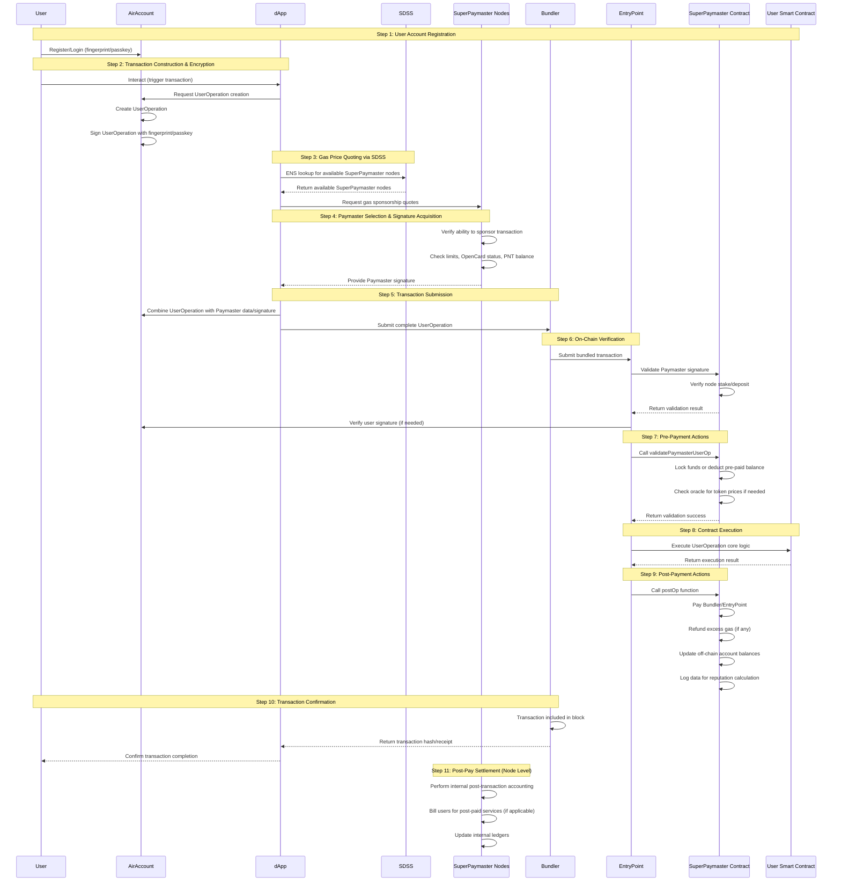
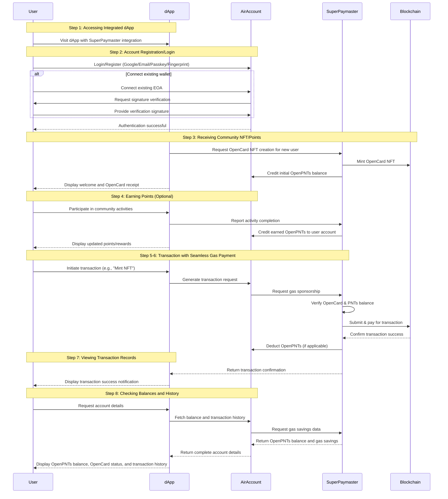
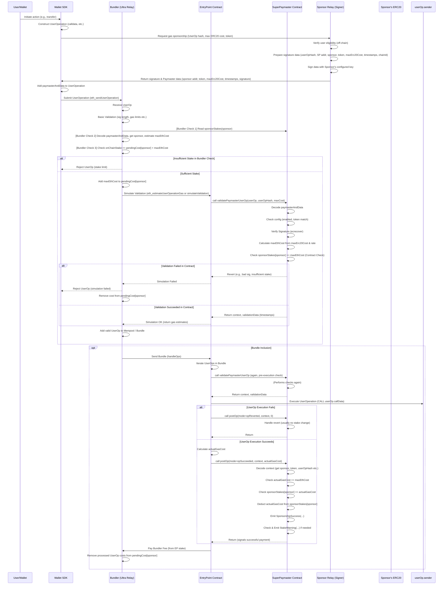

# SuperPaymaster: A Decentralized Ethereum Gas Payment System Based on ERC4337 and Account Abstraction

## Title

SuperPaymaster: A Decentralized Ethereum Gas Payment System Based on ERC4337 and Account Abstraction

## Authors

Huifeng Jiao, Dr. Nathapon Udomlertsakul, Dr. Anukul Tamprasirt, AAStar Team
International College of Digital Innovation, Chiang Mai University, Chiang Mai, 50200, Thailand
E-mail: huifeng_jiao@cmu.ac.th, nathapon.u@icdi.cmu.ac.th, anukul@innova.or.th, hi@aastar.io

## Keywords

**Blockchain, Ethereum, ERC-4337, Account Abstraction, Paymaster, Gas Payment, Decentralized Service System, SDSS**

## Highlights

- We provide a comprehensive overview of existing gas payment systems on the Ethereum blockchain and analyze their inherent weaknesses.
- We establish key guidelines and requirements for the design of a decentralized, seamless, and cost-effective gas payment system.
- We propose a novel gas payment (sponsor) system, leveraging the Ethereum platform and an application sponsorship model to address costly and complex processes.
- We conduct a proof of concept (PoC) to demonstrate the advantages of the proposed system over existing solutions and to outline potential future research directions.

## Abstract
Current blockchain gas payments impede widespread adoption due to high costs, complexity, and poor user experience (UX) rooted in HCI challenges. While Account Abstraction (ERC-4337) offers potential, centralized implementations often introduce critical risks like censorship and price manipulation, undermining decentralization.
This paper introduces SuperPaymaster, a novel gas payment system using ERC-4337 and a Standardized Decentralized Service System (SDSS) to create a truly decentralized, competitive, and user-friendly ecosystem. It directly tackles high costs, usability friction, and centralization vulnerabilities. SuperPaymaster provides an open-source framework enabling permissionless Paymaster nodes via a unified contract, fostering competition, supporting diverse ERC-20 gas tokens, and integrating with secure accounts like AirAccount via SDSS for streamlined, secure interactions.
By optimizing gas payments through decentralization and enhanced UX, SuperPaymaster aims to significantly lower entry barriers, improve blockchain interaction efficiency and usability, and ultimately accelerate Web3 adoption. A Proof-of-Concept (PoC) demonstrates the system's feasibility and potential advantages.

##  1. Introduction
Blockchain technology, underpinning a digital asset market valued in the trillions [Optional: Add citation], offers transformative potential for societal collaboration. However, its path to mass adoption is significantly hindered by user experience challenges, particularly surrounding the fundamental process of paying transaction fees, or "gas," on networks like Ethereum. As established by the Technology Acceptance Model (TAM) and Human-Computer Interaction (HCI) principles, perceived ease of use is critical for adoption [Optional: Add citation for TAM/HCI]. Currently, interacting with blockchain often involves a cumbersome and costly gas payment process, presenting substantial barriers related to usability, efficiency, and cost [Optional: Cite ultrasound.money for scale]. Users, especially newcomers, confront a steep learning curve involving numerous complex steps (often 10-15, including exchange interactions, KYC, wallet setup, and cross-chain transfers), high cognitive load, and opaque procedures [Briefly reference HCI gulfs]. These usability hurdles act as significant deterrents, preventing many from engaging with and realizing the value of decentralized applications (dApps).

The emergence of Account Abstraction (AA), particularly Ethereum's ERC-4337 standard [Optional: Add citation for ERC-4337], offers promising mechanisms like gas sponsorship (Paymasters) to alleviate some of these burdens. However, current implementations leveraging AA frequently introduce new centralization risks. Many rely on a limited number of centralized entities acting as Bundlers or Paymasters. This approach reintroduces vulnerabilities such as transaction censorship, potential price manipulation by dominant players, and single points of failure, directly conflicting with blockchain's core decentralization principles [Optional: Add citation on centralization risks/MEV]. Furthermore, practical limitations persist in these centralized solutions, including restricted support for diverse ERC-20 tokens as gas payment, lack of truly permissionless service operation, and complex integration efforts for dApp developers, leaving a critical gap for a genuinely decentralized alternative.

In this paper, we introduce SuperPaymaster, a gas payment system based on ERC-4337 Account Abstraction and a novel Standardized Decentralized Service System (SDSS) architecture. SuperPaymaster is designed to foster a truly decentralized, competitive, and user-friendly ecosystem for managing transaction fees. It directly addresses the limitations of previous approaches by enabling an open-source framework where anyone can permissionlessly operate Paymaster nodes. These nodes register via SDSS (using ENS for discovery) and compete to offer gas sponsorship, facilitating lower costs and accepting a wide variety of community-issued or standard ERC-20 tokens. Integration with user-centric wallets like AirAccount further enhances usability and security, aiming for a seamless payment experience. By decentralizing the paymaster layer and prioritizing user experience, SuperPaymaster seeks to significantly lower entry barriers, improve interaction efficiency, and accelerate the broader adoption of Web3 technologies. A Proof-of-Concept (PoC) is presented to demonstrate the system's feasibility.


## 2. Analysis of Current Gas Payment Systems and Associated Challenges
This section delves into the foundational aspects of gas payment mechanisms within EVM-compatible blockchains, outlines the typical user workflow, and critically examines the multifaceted challenges and vulnerabilities inherent in current systems, including usability barriers and the specific risks associated with centralized solutions.


### 2.1 The Gas Payment Mechanism
#### 2.1.1 Necessity of Gas Payment
The requirement for users to pay 'gas' for transactions is fundamental to the operation and security of public, permissionless blockchains like Ethereum. Due to the Turing-completeness of the Ethereum Virtual Machine (EVM), which allows for arbitrary computation, a mechanism is needed to prevent infinite loops and denial-of-service (DoS) attacks that could exhaust network resources (Wood, 2014, rev. 2022). Gas acts as a computational metering unit, assigning a cost to each operational step executed by the EVM. By requiring payment for computation, the gas mechanism ensures the sustainable use of shared public resources, prevents network abuse, and incentivizes validators (miners/stakers) to process transactions and secure the network (Buterin et al., 2015).

#### 2.1.2 Current Gas Payment Workflow
Executing a transaction on current blockchain systems typically involves a complex, multi-step workflow for the user, even before the core on-chain interaction occurs. A user often needs to: (1) Create an account on a centralized exchange (CEX); (2) Complete Know Your Customer (KYC) verification; (3) Purchase the blockchain's native token (e.g., ETH for Ethereum) using fiat currency; (4) Set up a self-custodial wallet (e.g., MetaMask); (5) Transfer the native token from the CEX to their wallet, incurring withdrawal fees; (6) Potentially perform cross-chain swaps or bridging if operating on a different network or requiring specific tokens, adding further complexity and cost; (7) Finally, initiate the desired transaction (e.g., interacting with a dApp), requiring careful setting of gas parameters (gas limit, gas price/priority fee) and signing with their private key. This intricate process serves as a significant initial barrier, particularly for non-technical users.

### 2.2 Challenges and Vulnerabilities in Current Systems
Existing gas payment systems suffer from a confluence of issues that impede usability, efficiency, and trust.

#### 2.2.1 User Experience Deficiencies
From both HCI and TAM perspectives, current systems exhibit numerous characteristics detrimental to user adoption. They often impose a high cognitive load, demonstrate poor usability across multiple dimensions (detailed in Section 2.3), involve significant direct and indirect costs, necessitate convoluted multi-step processes, offer a subpar overall experience, and raise security concerns for average users [Citation needed - General HCI/Usability reference, e.g., Nielsen Norman Group articles].

#### 2.2.2 Asset Fragmentation
The proliferation of diverse blockchain networks (Layer 1s and Layer 2s) necessitates users holding small balances of different native tokens (e.g., ETH on Ethereum mainnet, ETH on Arbitrum, MATIC on Polygon) simply to pay gas fees on each respective chain. This fragmentation increases user overhead, complicates asset management, and adds significant cumulative costs associated with acquiring and managing these disparate gas tokens [Citation needed - Analysis of multi-chain user costs].

#### 2.2.3 Operational Inefficiency
The multi-step workflow described in 2.1.2 is inherently inefficient. Each step, from CEX onboarding and KYC delays to cross-chain bridge waiting times and transaction confirmation latency, introduces friction and consumes considerable user time and effort. This inefficiency persists even for experienced users, hindering fluid interaction with dApps (Pacheco et al., 2023).

#### 2.2.4 Limitations of Existing Countermeasures
While various solutions aim to improve the gas payment experience (e.g., gas estimation tools, early forms of gas abstraction), they often provide only partial relief. Many still require users to possess native tokens or grapple with underlying complexities. Even emerging standards like ERC-4337, while promising, face adoption hurdles and do not inherently solve all usability or centralization issues in their current implementations [Citation needed - Review of gas optimization techniques/early AA].

#### 2.2.5 Risks of Centralized Gas Payment Services (Overview)
The rise of centralized services offering gas sponsorship (Paymasters) or transaction relaying (Bundlers), often associated with ERC-4337 implementations, introduces a new set of risks that potentially undermine blockchain's core principles. These include security vulnerabilities (e.g., facilitating MEV extraction like sandwich attacks, data breaches), the potential for transaction manipulation or censorship based on the provider's policies or jurisdiction, and the risk of market monopolies leading to inflated costs and reduced innovation (Daian et al., 2020). A detailed analysis follows in Section 2.4. It's paradoxical that permissionless accounts, readily created via ECDSA, often necessitate centralized identification and payment methods to acquire gas for initiating decentralized transactions.

### 2.3 Usability Challenges in Gas Payment: An HCI Perspective
The fundamental challenges outlined previously manifest as significant usability barriers when analyzed through the lens of Human-Computer Interaction (HCI).

#### 2.3.1 Ease of Learning & Complex On-Chain Transaction Process
The process described in Section 2.1.2, often involving 7 to 5 distinct steps for a novice user, presents a formidable learning curve. Each step requires understanding new concepts (e.g., wallets, addresses, gas units, Gwei, transaction finality) and mastering new skills (e.g., securing seed phrases, interacting with CEXs and wallets), drastically hindering the ease with which new users can learn to navigate the system effectively (Nielsen, 2012).

#### 2.3.2 Gulf of Execution
Users often struggle to map their intention (e.g., "send money," "buy an NFT") onto the required sequence of actions demanded by the system. This gap, known as the Gulf of Execution (Norman, 2013), is exacerbated by the need to acquire native tokens beforehand, manage cryptographic keys, and manually configure transaction parameters like gas fees – actions far removed from the user's primary goal and unfamiliar compared to traditional financial interactions.

#### 2.3.3 Gulf of Evaluation
Users frequently encounter difficulties in understanding the system's state and the consequences of their actions, reflecting a wide Gulf of Evaluation (Norman, 2013). The volatility and opacity of gas fees make cost prediction challenging. Feedback on transaction progress is often limited to technical hashes or block explorer links, and reasons for transaction failures can be cryptic, leaving users uncertain about outcomes and how to proceed.

#### 2.3.4 Efficiency Issues
Beyond the sheer number of steps, the time involved in completing the gas payment workflow significantly impacts efficiency. Delays associated with KYC verification, fiat-to-crypto conversions, CEX withdrawal processing, cross-chain bridging, and on-chain transaction confirmation times collectively create a slow and cumbersome experience, hindering rapid or spontaneous interactions with dApps (Pacheco et al., 2023).

#### 2.3.5 Error Rate and Lack of Fault Tolerance
The unforgiving nature of blockchain transactions contributes to a high potential for user error. Sending funds to an incorrect address, selecting the wrong network during transfers, or setting inadequate gas fees can lead to irreversible loss of funds or failed transactions. Current systems generally lack robust error prevention mechanisms or 'undo' functionalities common in other software, offering minimal fault tolerance (Reason, 1990).

#### 2.3.6 Memorization Difficulties
The cognitive burden extends to memorization. Users are expected to securely remember or store complex seed phrases or private keys, differentiate between numerous long, cryptic addresses, and recall specific procedures for different dApps or chains. Wallet interfaces themselves can be complex, further increasing the load on user memory.

#### 2.3.7 User Satisfaction Issues
Cumulatively, the high cognitive load, inefficiency, potential for costly errors, and steep learning curve often lead to user frustration and low satisfaction. While aesthetics and interaction flow also play a role, the fundamental usability hurdles associated with gas payments significantly detract from a positive user experience.

#### 2.3.8 Lack of Supporting Tools and Infrastructure
The blockchain ecosystem often lacks standardized, readily available tools for dApp developers to easily integrate user-friendly gas payment solutions. This forces many dApps to either rely on the often-complex interfaces of external wallets or invest significant resources in building custom, potentially inconsistent, usability layers.

#### 2.3.9 High Cognitive Load
Interacting with blockchain gas systems demands significant mental effort due to the sheer volume of novel technical concepts users must process (e.g., Gas, Gwei, Nonce, block confirmations, smart contracts, MEV). This aligns with Cognitive Load Theory, where excessive extraneous cognitive load (load imposed by the interface and task design) hinders learning and performance (Sweller, 1988).

#### 2.3.10 Low Perceived Ease of Use
Consequently, the initial perception for many potential users is that blockchain systems are inherently complex, expensive, cumbersome, and potentially insecure. This low perceived ease of use, a key factor in the Technology Acceptance Model (Davis, 1989), acts as a major barrier to trial and adoption, regardless of the perceived usefulness of the underlying dApp.

### 2.4 Risk Analysis of Centralized Gas Payment Services
While centralized services aim to simplify gas payments, often leveraging ERC-4337 components like Paymasters, they introduce distinct risks stemming from their centralized nature, bring new risk to make blockchain be centralized.

#### 2.4.1 High Integration Costs and Low Adoption Rate
Integrating proprietary, centralized gas payment solutions can be different solutions and costly for dApp developers, often involving specific SDKs and service agreements. Furthermore, the inherent gas overhead associated with smart contract accounts (required by ERC-4337) compared to simpler EOA transactions can add costs, potentially limiting the adoption of these solutions despite their usability benefits [Citation needed - Analysis of AA gas overhead/integration costs].

#### 2.4.2 Transaction Manipulation Risks
Centralized Bundlers or Paymasters occupy a privileged position in the transaction supply chain. This position can be exploited for Maximal Extractable Value (MEV) through practices like front-running (executing their own transaction based on user's transaction information) or sandwich attacks (bracketing a user's trade with their own buy and sell orders), extracting value at the user's expense (Daian et al., 2020).

#### 2.4.3 Privacy Leakage Risks
These centralized entities aggregate vast amounts of transaction data. This data, potentially linkable to IP addresses or other identifiers, can reveal user behavior patterns and financial activities. There is a risk of this data being leaked through breaches, sold to third parties, or used for surveillance, compromising user privacy.

#### 2.4.4 Legal and Regulatory Compliance Risks
Centralized services are subject to the laws and regulations of the jurisdictions in which they operate. This can lead to censorship, where transactions originating from or destined for certain addresses (e.g., those on sanction lists like OFAC's) are blocked. This dependency on jurisdictional compliance contradicts the permissionless ideal of public blockchains and highlights the irony of needing centralized identity verification (KYC/AML on exchanges) to acquire funds for permissionless transactions.

#### 2.4.5 Limited Gas Token Support
Centralized Paymasters often restrict the types of ERC-20 tokens accepted for gas fee payments, typically favoring major stablecoins or their own platform tokens. This limits user choice, potentially forcing users into additional costly swaps, and hinders the ability of communities to utilize their native tokens for network participation.

#### 2.4.6 Long-term Monopoly and Cost Inflation Risks
The market for centralized relayers and paymasters shows signs of concentration [Citation needed - Market share data, e.g., reports on Flashbots dominance or major paymaster providers]. This concentration creates a risk of oligopolistic or monopolistic behavior, where dominant players could potentially increase fees, reduce service quality, or stifle innovation in the long run due to diminished competitive pressure.


## 3. The Proposed System Overview: SuperPaymaster
Addressing the multifaceted challenges detailed in Section 2 requires a paradigm shift from centralized or simplistic gas payment solutions towards a decentralized, user-centric, and competitive ecosystem. This section introduces SuperPaymaster, a novel system designed to achieve this vision. We first outline the critical requirements for such a system, then provide an overview of SuperPaymaster's architecture and actors, delve into its core components including the foundational Standardized Decentralized Service System (SDSS), explain its trust model, and finally, detail its operational workflows from both system and user perspectives.

### 3.1 Requirements Specification for a Decentralized Gas Payment System
Based on the analysis of existing system limitations and user needs, an ideal decentralized gas payment system must satisfy the following key requirements:

#### 3.1.1 Security Requirements
The system must ensure the integrity of transactions and the security of user funds and transaction data. This includes robust authentication, protection against common blockchain attacks, and secure handling of cryptographic keys and signatures. Integration with secure account systems like AirAccount, potentially utilizing biometric second-factor authentication (D2FA), is crucial.

#### 3.1.2 Privacy Requirements
User transaction data and identities should be protected. Service nodes should operate in a privacy-preserving manner, potentially leveraging technologies like Trusted Execution Environments (TEEs), minimizing data exposure and preventing surveillance or data leakage.

#### 3.1.3 Availability Requirements
The gas payment service must be consistently available and reliable. This necessitates a decentralized network of service providers (nodes) with redundancy and fault tolerance, accessible via standardized interfaces like RESTful APIs through the SDSS.

#### 3.1.4 Usability Requirements
The system must be intuitive and easy to use, abstracting away underlying complexities. Concepts like OpenCards/NFT should enable seamless, near-invisible gas payments, mimicking Web2 experiences and drastically lowering the barrier for non-technical users.

#### 3.1.5 Cost-Effectiveness Requirements
The system should facilitate lower gas payment costs compared to traditional methods or centralized alternatives. Mechanisms like competitive quoting and the ability to use community-earned points (OpenPNTs) via OpenCards, potentially achieving zero or negative costs for users, are essential.

#### 3.1.6 Efficiency Requirements
Transaction processing, including gas sponsorship and payment, should be swift and efficient. A decentralized network of nodes, potentially incentivized for performance, combined with streamlined workflows, should minimize delays.

#### 3.1.7 Competitiveness Requirements
The system must foster a competitive market among gas service providers to prevent monopolies and ensure fair pricing. Competitive quoting and reputation-based ranking are key mechanisms.

#### 3.1.8 Openness and Permissionless Requirements
The system should be built on open-source principles, allowing anyone to participate as a user, developer, or service node operator without requiring permission from a central authority. This includes the ability for communities to issue their own gas tokens (OpenPNTs) and for nodes to freely join the SuperPaymaster network.

### 3.2 Overview of the SuperPaymaster System
SuperPaymaster is proposed as a decentralized gas payment (sponsorship) system built upon the ERC-4337 standard and leveraging a novel Standardized Decentralized Service System (SDSS) architecture. Its core objective is to create an open, competitive, and resilient marketplace for gas sponsorship, addressing the cost, usability, efficiency, and centralization issues prevalent in existing solutions. Key motivations include providing a single, consistent Paymaster address across chains for developer convenience and unifying the staking mechanism for all participating sponsors (LPs/Nodes) to enhance overall system trust and reliability. It facilitates various user-friendly payment models addressing the cost and usability issues, including Gas Card/OpenCards, pre-paid "Gas Tanks," and potentially post-paid credit systems (PostPayCard), all managed within a decentralized framework.

### 3.3 Involved Actors and Roles
The SuperPaymaster ecosystem involves several key actors:

**End Users**
Individuals interacting with dApps who require gas payments for their transactions. They benefit from simplified processes, lower costs, and enhanced security via systems like AirAccount.

**dApps (Decentralized Applications)**
Applications integrating SuperPaymaster (via SDSS APIs) to offer seamless gas payment experiences to their users.

**Communities**
Groups or organizations that may issue their own ERC-20 tokens (OpenPNTs) usable for gas payments within the SuperPaymaster network via OpenCards, fostering community engagement.

**Node Operators (Gas Sponsors / LPs)**
Entities running the SuperPaymaster service nodes. They register within the SDSS, stake collateral in the SuperPaymaster contract, listen for gas sponsorship requests, provide quotes, sign UserOperations, and facilitate gas payments. They are incentivized through service fees and reputation gains. Multiple node types (N1, N2, N3 with varying capabilities like TEE) may exist.

**Bundlers / RPC Providers**
Entities responsible for bundling UserOperations (containing Paymaster data) into transactions and submitting them to the blockchain's transaction pool (or directly to block builders under future proposals like EIP-7560).

**Third-Party Swap Services (Optional)**
Services that may be integrated to facilitate real-time conversion between various ERC-20 tokens and the native gas token (e.g., ETH) if required by the Paymaster node.

### 3.4 SDSS (Standardized Decentralized Service System) Overview
SDSS serves as the foundational communication and discovery layer for decentralized services within the SuperPaymaster ecosystem. It aims to provide a secure, transparent, and user-friendly architecture for basic decentralized computing services, moving beyond reliance on traditional centralized cloud infrastructure. Its core components facilitate the discovery and interaction with permissionlessly operated service nodes.

(Note: Detailed SDSS components are elaborated in 3.5.2)

### 3.5 Key Components of the SuperPaymaster Ecosystem
SuperPaymaster integrates several key technological and economic components:

#### 3.5.1 SuperPaymaster Core
We build SuperPaymaster based on ERC4337, so there are 4 parts:

1. SuperPaymaster contract: stake the ETH and verify the signature, pay the gas sponsorship.
2. SuperPaymaster server: handle the user operation and sign a signature after or post deduce your ERC20 token balance.
3. SuperPaymaster API: response to some quota and routing services directly or push to pool timely.
4. SuperPaymaster client/dApps: initiate the user operation and submit it to bunlder after get the gas sponsorship signature from SuperPaymaster server.


#### 3.5.2 Standardized Decentralized Service System (SDSS)
SDSS provides the core decentralized service system by 4 different levels nodes:
1. N0(Node 0) means client developed with Tauri+Node.js for cross platform
2. N0 can access N1 to N3, based on SDSS provided decentralized routing and computing services.
3. N1: static file service and ENS resolution API services.
4. N2: provide TEE+hardware wallet services based on Raspberry Pi 5B on ARM chips.
5. N3: running a Docker (Supabase service).
It means any one can run a node in any level: N0, N1, N2, N3 for service or providing service.

##### 3.5.1.1 ENS for Service Discovery
Utilizes the Ethereum Name Service (ENS) for human-readable naming (e.g., node.ethpaymaster.eth) and service endpoint resolution. Nodes register their API endpoints and metadata within ENS records, allowing dApps and users to discover available service providers dynamically. This acts as a decentralized alternative to centralized service registries.

##### 3.5.1.2 Node Registration Mechanism
Provides a secure, potentially anonymous (pseudonymous via blockchain address) on-chain mechanism for nodes to register their service capabilities, API endpoints (via ENS), and public keys. This registration often involves staking collateral into the SuperPaymaster contract.

##### 3.5.1.3 Dynamic Routing Discovery
Enables callers (dApps) to find suitable service nodes by querying the ENS-based registry or potentially through cached lists maintained by clients (like AirAccount). This allows for load balancing, failover, and selection based on criteria like reputation or proximity.

#### 3.5.3 Competitive Quoting Mechanism
Instead of relying on a single provider's price, dApps can query multiple registered SuperPaymaster nodes (discovered via SDSS) for gas sponsorship quotes for a specific transaction. The dApp can then select the most favorable quote (e.g., lowest cost, highest reputation node), fostering price competition and preventing monopolies.
They(dApps) can fetch by a single API from SDSS service to get multiple quotes and access API URLs. All quotes will be updated by SDSS.

#### 3.5.4 Self-Custodial AirAccount Integration
Leverages the AirAccount system for user account management. All user operations will be signed by AirAccount with users' biometric(finger print or pass key). And the on-chain account contract will verify every transaction with BLS12-381/EIP2537 and secp256k1/ECDSA.

##### 3.5.4.1 Fingerprint-based Security
Employs device-based biometrics (e.g., fingerprint via Secure Enclave/TEE, FIDO2/Passkey standards) for transaction signing and potentially second-factor authentication (D2FA), enhancing security beyond traditional private keys while improving usability ("Just press fingerprint").

##### 3.5.3.2 Enhanced Contract Account Features
Inherits benefits of smart contract accounts managed by AirAccount, such as social recovery, account migration ("moving house"), spending limits, and potentially will execution features.

#### 3.5.5 Open Community Model
Empowers communities and users with flexible gas payment options. The communities can run a Community Node permissionless. The users can get guidance from communities and gas sponsorship options.

##### 3.5.4.1 Permissionless Community Tokens (OpenPNTs)
Allows any community to issue its own ERC-20 compliant token (Points/PNTs) and configure SuperPaymaster nodes to accept these tokens for gas payments, fostering community activities.

##### 3.5.4.2 NFT-based Gas Cards (Cards/OpenCards)
Implements gas payment allowances or pre-paid balances using NFTs or SBTs (potentially conforming to ERC-721 or EIP-6551 for token-bound accounts). Users holding specific Cards can have their gas fees automatically paid (up to certain limits or using associated PNT balances), creating a seamless "gasless" experience.

##### 3.5.4.3 Task-for-Points Mechanism
Enables users to earn community PNTs by completing tasks (e.g., social promotion, content creation), which can then be used to pay for gas via OpenCards, potentially reducing the net cost of gas to zero or even negative.

### 3.6 SuperPaymaster Trust Model
Trust in the decentralized SuperPaymaster system is established through a combination of cryptographic verification, economic incentives, reputation, and community governance:

##### 3.6.1 Decentralized Node Mechanism
Relies on a network of independent nodes registered on-chain. Security is enhanced through standard public/private key cryptography (secp256k1/ECDSA) and potentially advanced schemes like BLS threshold signatures among cooperating nodes for increased resilience and efficiency (referencing EIP-2537 for BLS precompiles). The decentralized node mechanism is a key component of the SDSS system, ensuring that the system is secure and reliable with a plugin architecture to change the algorithm like Post-Quantum Algorithm in the future.

##### 3.6.2 Reputation Mechanism
A crucial component (potentially following standards like EIP-7253) where node performance is tracked based on objective metrics like successful transaction sponsorship rate, API response time, uptime, and the amount of staked collateral (Stake). Higher reputation nodes may receive preferential routing or higher trust scores, incentivizing reliable service.

##### 3.6.3 On-Chain Contract Verification
The core SuperPaymaster smart contract enforces rules transparently. It verifies node signatures, manages staked collateral, handles gas payments to the EntryPoint contract, potentially manages profit distribution logic, and serves as an auditable source of truth.

##### 3.6.4 Community Governance Model
Proposes a model where stakeholders (e.g., node operators, potentially token holders or users) participate in system governance, influencing parameters, upgrades, and dispute resolution, possibly weighted by reputation and stake.

##### 3.6.5 Trust Flywheel
A positive feedback loop where nodes offering competitive prices and maintaining high stake/success rates gain higher reputation, attract more user transactions, achieve greater sustainability, and further solidify their trustworthy position within the ecosystem.

### 3.7 Core Gas Sponsorship Workflow (System Perspective)
The following steps outline the typical process flow when a transaction is sponsored via SuperPaymaster:

Step 1: User Account Registration: User registers/logs in via AirAccount (new or bound EOA).

Step 2: Transaction Construction & Encryption: User interacts with a dApp, generating transaction data (UserOperation). AirAccount (using fingerprint/passkey) signs the UserOperation.

Step 3: Gas Price Quoting via SDSS: The dApp (or user's wallet/AirAccount backend) uses SDSS (via ENS lookup) to discover available SuperPaymaster nodes and requests gas sponsorship quotes for the UserOperation.

Step 4: Paymaster Selection & Signature Acquisition: The dApp selects the best quote (based on price, reputation) and requests a Paymaster signature from the chosen node for the UserOperation. The node verifies its ability to sponsor (e.g., checks internal limits, user's OpenCard status/PNT balance if applicable) and provides the signature.

Step 5: Transaction Submission: The dApp/wallet submits the UserOperation (now including the Paymaster signature and data) to a Bundler or directly to an RPC endpoint supporting ERC-4337 (or future AA standards like EIP-7560).

Step 6: On-Chain Verification: The Bundler includes the UserOperation in a bundle transaction sent to the global EntryPoint contract. The EntryPoint verifies the UserOperation, including calling the specified SuperPaymaster contract to validate the Paymaster signature and ensure sufficient deposit/stake exists. AirAccount's signature might also be verified on-chain if needed.

Step 7: Pre-Payment Actions (within Paymaster validatePaymasterUserOp): The SuperPaymaster contract, during validation, checks the sponsoring node's stake and potentially locks funds or deducts pre-paid balance (e.g., from Gas Tank/OpenCard associated PNTs). It may need to consult an oracle for real-time token prices if accepting non-native tokens.

Step 8: Contract Execution: If validation succeeds, the EntryPoint executes the core logic of the UserOperation (e.g., token transfer, NFT claim).

Step 9: Post-Payment Actions (within Paymaster postOp): After execution, the EntryPoint calls the SuperPaymaster contract's postOp function. This function handles the actual gas payment reconciliation: paying the Bundler/EntryPoint, potentially refunding excess gas pre-payment to the user/node, updating off-chain account balances, and logging data for reputation calculation.

Step 10: Transaction Confirmation: The Bundler's transaction containing the UserOperation bundle is included in a block and finalized on the blockchain. A transaction hash/receipt is returned.

Step 11: Post-Pay Settlement (Node Level): The sponsoring SuperPaymaster node performs its internal post-transaction accounting, potentially billing users for post-paid services or updating internal ledgers.

A sequence diagram illustrating

### 3.8 Typical User Interaction Workflow (User Perspective)
From the end-user's viewpoint, the process is significantly simplified:

Step 1: Accessing Integrated dApp: User visits a dApp that has integrated SuperPaymaster and AirAccount.

Step 2: Account Registration/Login: User logs in or registers using their familiar Web2 method (Google/Email via Passkey/Fingerprint) or by connecting an existing EOA (verified via signature) through the AirAccount interface.

Step 3: Receiving Community NFT/Points (Scenario): Upon joining a community via the dApp, the user might automatically receive an OpenCard NFT representing a gas allowance or initial OpenPNTs balance.

Step 4: Earning Points (Optional): User participates in community activities (e.g., sharing content, completing tasks) and earns OpenPNTs credited to their account/OpenCard.

Step 5: Initiating Transaction: User interacts with the dApp as intended (e.g., clicks "Mint NFT," "Transfer Tokens," "Buy Item").

Step 6: Seamless Gas Payment: The underlying SuperPaymaster system handles the gas payment. If the user holds a valid OpenCard with sufficient PNTs/allowance, the gas fee is automatically deducted or covered without requiring user confirmation or interaction with native tokens. The experience feels "gasless."

Step 7: Viewing Transaction Records: User receives confirmation of the successful transaction within the dApp, similar to a Web2 purchase confirmation. They can view details like transaction ID and status.

Step 8: Checking Balances and History: User can check their OpenPNTs balance, OpenCard status, and transaction history (including gas cost savings estimations) within their AirAccount interface or the dApp.

Sequence Diagram



## 4. Implementation (Proof of Concept - PoC)
This section details the Proof of Concept (PoC) implementation of the SuperPaymaster platform, covering smart contract development, the Standardized Decentralized Service System (SDSS) backend, node management, and user interface construction. Technological choices focused on enabling core functionalities—decentralized gas sponsorship, competitive quoting, enhanced user experience—and meeting security and interoperability requirements.

### 4.1 Technology Stack
The SuperPaymaster PoC utilized the following tools and frameworks:
Smart Contracts: Solidity [[Cite Solidity]] within the Foundry [[Cite Foundry]] framework implemented the core SuperPaymaster contract and auxiliary contracts for ENS resolution, OpenPNTs (ERC-20), OpenCards (ERC-721), and node registration.
User Interfaces: Next.js [[Cite Next.js]] (React [[Cite]], Node.js [[Cite]]) built web frontends.
Desktop Clients: Tauri [[Cite Tauri]] packaged cross-platform clients (Windows, MacOS, Linux, iOS, Android, Web) supporting N0 user nodes and N1 service nodes.
Backend Services: Go [[Cite Go]] and Rust [[Cite Rust]] developed backend/node on libp2p; Rust targeted performance-critical components and potential TEE-based services (N2 nodes).
Deployment & Infrastructure: Docker [[Cite Docker]] provided containerization. A customized Supabase [[Cite Supabase]] instance handled BaaS, database, and storage functionalities (N3 nodes).
Account Management: The AirAccount API [[Cite AirAccount]] managed user account lifecycles, security, and authentication.
Hardware Testing (DePIN): Raspberry Pi 5B devices [[Cite Raspberry Pi]] served as representative compute nodes for testing backend components.


### 4.2 System Setup and Configuration
We need to setup AirAccount, SuperPaymaster Nodes and CometENS Configuration, to set interaction config with decentralized account supporting gas sponsorship, and a basic config for OpenPNTs, OpenCards and more parameters to pay your gas seemlessly. Also we need create cross-chain CometENS API name for node registry to get decentralized invoking.

### 4.3 Smart Contract Design and Development
Smart contract is the key part of the system, through mutable on-chain code, to ensure verification of gas payment signatures, payment of gas, deduction of reasonable PNTs, allocation of PNTs income, calculation of reputation (success rate) and Slash etc.
We only introduce core ability of SuperPaymaster contract, more details can be found in [SuperPaymaster Design 0.13](../solutions/SuperPaymaster_v0.13.pdf).
1. Stake: Sub-account stake management for security and gas sponsor
2. Verify and Pay: Sub-account signature verification, payment, record and balance maintenance
3. Post Processing: Transaction success post processing: reputation increase
4. Compensation: Asynchronous transaction status compensation: failed and successful re-check, proof submission and reputation modification (off-chain, call on-chain method)
#### 4.3.1 Main Flow


#### 4.3.2 SuperPaymaster Contract

The smart contract has two main functions: stake and verifyAndPay, more details can be found in [SuperPaymaster](https://github.com/AAStarCommunity/SuperPaymaster-Contract).
We build this contract based on ERC4337 and other Open-source projects: Pimilico singleton paymaster(https://github.com/pimlicolabs/singleton-paymaster) and ZeroDev bundler(https://github.com/zerodevapp/ultra-relay).
We add sub-account stake module to permit permissionless staker to run their own paymaster for supporting their own ERC20 gas tokens. We improve verify funtion to avoid over-use risk with on-chain contract and off-chain bundler. Also we build SuperPaymaster relay server framework to support dApps to query gas price and pay gas with different ERC20 supporting.
Stake manager contract provide a stake reputation and ETH payment guarantee for every ERC20 gas payment.
```solidity
// SuperPaymaster.sol main function1: Stake manager

    /*´:°•.°+.*•´.*:˚.°*.˚•´.°:°•.°•.*•´.*:˚.°*.˚•´.°:°•.°+.*•´.*:*/
    /*                    SPONSOR MANAGEMENT                       */
    /*.•°:°.´+˚.*°.˚:*.´•*.+°.•°:´*.´•*.•°.•°:°.´:•˚°.*°.˚:*.´+°.•*/

    /**
     * @notice Set the withdrawal delay period
     * @param _withdrawalDelay New delay period in seconds
     */
    function setWithdrawalDelay(uint256 _withdrawalDelay) external onlyAdminOrManager {
        require(_withdrawalDelay > 0, "SuperPaymaster: withdrawal delay must be positive");
        withdrawalDelay = _withdrawalDelay;
    }

    /**
     * @inheritdoc ISuperPaymaster
     */
    function registerSponsor(address sponsor) external override onlyAdminOrManager {
        require(!isSponsor[sponsor], "SuperPaymaster: sponsor already registered");
        isSponsor[sponsor] = true;
        
        // Initialize with default config (owner = sponsor itself)
        sponsorConfigs[sponsor] = SponsorConfig({
            owner: sponsor,
            token: address(0),
            exchangeRate: 0,
            warningThreshold: 0,
            isEnabled: false,
            signer: address(0)
        });
        
        emit SponsorRegistered(sponsor);
    }

    /**
     * @inheritdoc ISuperPaymaster
     */
    function setSponsorConfig(
        address token,
        uint256 exchangeRate,
        uint256 warningThreshold,
        address signer
    ) external override {
        address sponsor = msg.sender;
        require(isSponsor[sponsor], "SuperPaymaster: not a sponsor");
        require(msg.sender == sponsorConfigs[sponsor].owner, "SuperPaymaster: only sponsor can modify settings");
        require(token != address(0), "SuperPaymaster: invalid token address");
        require(signer != address(0), "SuperPaymaster: invalid signer address");
        
        SponsorConfig storage config = sponsorConfigs[sponsor];
        config.token = token;
        config.exchangeRate = exchangeRate;
        config.warningThreshold = warningThreshold;
        config.signer = signer;
        
        emit SponsorConfigSet(sponsor, token, exchangeRate, warningThreshold, signer);
    }
```

verifyAndPay provides a security guarantee for dApps to pay gas with different ERC20 tokens under their credit stake amount.

```solidity
// SuperPaymaster.sol main function2: verifyAndPay
    function validateSponsorUserOp(
        PackedUserOperation calldata userOp,
        bytes32 userOpHash,
        uint256 /*requiredPreFund*/,
        bool allowAllBundlers,
        bytes calldata paymasterConfig
    ) internal returns (bytes memory context, uint256 validationData) {
        // 检查bundler权限
        if (!allowAllBundlers && !isBundlerAllowed[tx.origin]) {
            revert BundlerNotAllowed(tx.origin);
        }
    
        // 检查是否重放攻击
        require(!processedOps[userOpHash], "SuperPaymaster: operation hash already processed");
    
        // 解析sponsor数据
        (
            address sponsor,
            address token,
            uint256 maxErc20Cost,
            uint48 validUntil,
            uint48 validAfter,
            bytes calldata signature
        ) = _parseSponsorConfig(paymasterConfig);
        
        // 验证sponsor是否有效
        require(isSponsor[sponsor], "SuperPaymaster: invalid sponsor");
        require(sponsorConfigs[sponsor].isEnabled, "SuperPaymaster: sponsor not enabled");
        
        // 验证token是否匹配
        require(token == sponsorConfigs[sponsor].token, "SuperPaymaster: token mismatch");
        
        // 获取sponsor配置的签名者
        address signer = sponsorConfigs[sponsor].signer;
        
        // 创建消息哈希用于验证签名
        bytes32 hash = _getSponsorHash(userOp, userOpHash, sponsor, token, maxErc20Cost, validUntil, validAfter);
        
        // 验证签名
        (bytes32 r, bytes32 s, uint8 v) = _extractSignature(signature);
        address recoveredSigner = ecrecover(hash, v, r, s);
        
        // 检查签名是否有效
        if (recoveredSigner != signer) {
            revert("SuperPaymaster: invalid sponsor signature");
        }
        
        // 计算最大ETH成本
        uint256 exchangeRate = sponsorConfigs[sponsor].exchangeRate;
        require(exchangeRate > 0, "SuperPaymaster: invalid exchange rate");
        
        // 计算maxEthCost: (maxErc20Cost * 1 ether) / exchangeRate
        uint256 maxEthCost = (maxErc20Cost * 1 ether) / exchangeRate;
        
        // 获取sponsor stake
        EnhancedSponsorStake storage stake = sponsorStakes[sponsor];
        
        // 确保sponsor有足够的stake
        require(
            stake.stakedAmount >= maxEthCost,
            "SuperPaymaster: insufficient sponsor stake"
        );

        // 锁定此操作的资金
        if (stake.userOpLocks[userOpHash] == 0) {
            stake.lockedAmount += maxEthCost;
            stake.userOpLocks[userOpHash] = maxEthCost;
            emit StakeLocked(sponsor, userOpHash, maxEthCost);
        }
        
        // 打包验证数据（签名有效性和时间戳）
        validationData = _packValidationData(false, validUntil, validAfter);
        
        // 编码上下文供postOp使用
        context = abi.encode(sponsor, token, maxEthCost, maxErc20Cost, userOpHash);
        
        emit UserOperationSponsored(userOpHash, userOp.getSender(), SPONSOR_MODE, token, maxErc20Cost, maxEthCost);
        
        return (context, validationData);
    }

```
#### 4.3.3 ENS API System
ENS is a decentralized way to publicate your service to the world. We will create a Registry Contract for any stakers to register their service.
And we will create a Resolver Contract for any stakers to resolve their service in ENS name.
ENS is not only a domain name resolver, but also a decentralized storage system which can save text record and more data.
```Javascript
// Standard Restfull API
baseURL = "https://api.aastar.io";
baseENS = "api.zparty.eth";
nodeName = "XXXDAO";
serviceList = ["SuperPaymaster"];
setName to set your own node address.
setPubkey to set your own node public key(not a stable way).
setSubnodeOwner to set your own node sub domain owner on the L1 ENS Registry.
setContenthash to help node to have a readme web page in IPFS or other hash address.

```
We need deploy a Resolver contract in Optimism Layer2.

```solidity


```

### 4.4 Backend Service Implementation
#### 节点注册
所有后端服务都需要先注册为节点
1. 生成节点公钥和私钥
2. 调用node registration API注册节点
3. 需要stake和一些授权
节点注册程序由前端（Ether.js）和后端（Go）实现
未来迁移到TEE中管理秘钥。

#### SuperPaymaster节点后台服务
1. 节点注册：SuperPaymaster可以验证是否是注册节点，查询stake额度
2. SuperPaymaster后台服务（节点）收到来自dApps的API询价请求，一般协调节点汇总各个paymaster节点报价：支持ERC20 token列表和价格和其他参数。
3. SuperPaymaster后台服务（节点）收到来自dApps的API支付请求，包括交易数据和用户二次确认的指纹签名，验证签名是否OK
4. 收到代付gas的签名请求，一般先验证指纹签名
    - 确认此签名是来自于用户的指纹（公钥在参数中或者链上ENS注册）
    - 确认指纹对此交易有效，且在有效期
5. SuperPaymaster后台服务（节点）检查用户绑定的OpenCard NFT余额足够后，发送请求到SuperPaymaster合约代扣PNTs，代扣会存入节点账户。
6. SuperPaymaster后台服务（节点）给交易做单独的paymasterAndData签名，承诺链上会支付gas
7. 后续链上交互：dApps会调用Bundler处理交易，Bundler会调用Entrypoint来检查（调用SuperPaymaster验证签名）和支付gas

#### ENS管理节点后台服务
我们使用ENS来作为跨链的唯一性解决方案，来保障不同链上的合约有统一的约定地址，例如在OP上是op.ethpaymaster.eth, 而Arbi上是arb.ethpaymaster.eth。那我们需要一个二级域名注册和管理的工具，就我了解，ENS V2还在开发中，目前的V1方案是半中心化：你需要运行一个中心化服务器提供注册，以及响应链上的查询。但我不确定是否有新版本ENS API发布了。
我们需要实现：
1. 节点注册：任何节点都要先到node registry注册，参考上面
2. ENS管理节点会预先配置一个根域名，例如zparty.eth
3. ENS管理节点会接受查询一个子域名，例如jason.zparty.eth是否存在，返回结果，例如一个地址
4. ENS管理节点会接受新增一个子域名，例如jack.zparty.eth和0x1234567890123456789012345678901234567890的地址，返回执行结果
5. 每个节点都可以注册三级域名jason.node.zparty.eth，返回执行结果
6. 所有注册的二级，三级域名，都可以被ether.js和其他支持ens解析的lib解析，实现去中心化域名的免费分发
6. node在注册三级域名时，还需要提供text记录，例如提供的服务，api name，IP地址和域名
请帮助我分析和调研，然后给出一个技术解决方案和开发需要的sdk等github repo，以及初步的系统架构，技术选型等。
遵守ENS最新开发规范：，未来会支持ENSV2新规范（Namechain，建设中：https://roadmap.ens.domains/l2-roadmap/）


### 4.5 Frontend and Desktop Application Development
        Next.js Web交互, Tauri打包为跨平台的客户端。
        使用Rust开发节点管理服务，实现一些难点。
#### 节点管理服务
        注册：生成密钥对，stake token，授权转移token
        查看：查看节点信息，查看stake信息，查看reputation信息
        管理：配置ENS的text信息，管理API列表和域名/IP
        管理：管理节点状态，例如开启/关闭
#### 简单dApp Demo
        COS72，集成了AirAccount
        注册/绑定Web2 Account
        验证邮箱
        EOA绑定
        指纹绑定
        生成AirAccount
        购买Item交互
        签名交易申请
        交易成功返回
#### SuperPaymaster配置管理
        1. 节点注册后要加入OpenCards/OpenPNTs协议
        2. 发行自己的社区积分和社区白板NFT（加入就送NFT）
        3. 充值自己的ETH到SuperPaymaster
        4. 设置Gas Token/PNTs接受地址列表和价格
        5. SuperPaymaster Dashboard

### 4.6 AirAccount Integration
        描述如何集成AirAccount的账户生成和二次加密功能
        任何dApps都可以集成AirAccount
        1. node.js版本SDK安装
        2. 一些约定和配置
        3. 核心API调用
### 4.7 SDSS Implementation Details
        在节点完成节点注册、ENS配置后，可以加入SDSS网络了
        安装COS72基础版客户端后
        1. 查看N1到N5的stake要求和性能要求
        2. 运行硬件检查程序，推荐你适合运行的节点
        3. 拉取合适的服务包或者Docker image
        4. 启动服务，测试是否对外提供服务
        5. 查看自己的积分收入和Reputation变化
mermaid流程图

        节点通信图

        基础交易数据结构
        AirAccount二次签名数据结构
        paymasterAndData数据结构
        验证AirAccount签名
        BLS聚合签名

        Gas Token PNTs流转过程

### 4.8 OpenCards/OpenPNTs Implementation
        NFT/SBT合约实现，积分管理逻辑
        1. 基于你的AirAccount，访问COS72.org
        2. 建立自己的社区、积分和白板NFT

## 5. Discussion
        *   5.1 Addressing Usability Challenges (讨论SuperPaymaster如何解决易用性问题)
            *   ENS for Dynamic Service Access
            *   Reputation Mechanism for Success Rate Guarantee
            *   Competitive Quoting for Cost Reduction
            *   Community Tokens for Low/Negative Cost
            *   NFT Cards for Seamless Payment
        *   5.2 Security Enhancements (讨论安全增强措施：二次加密, TEE)
        *   5.3 Implications of Findings (对评估结果的解读 - *需结合第5章评估结果*)
        *   5.2.4 Limitations (研究的局限性 - *可从第6章移部分过来*)

## 6 Related Work and Comparison
        *   (将SuperPaymaster与现有方案在安全、隐私、成本、开放性、易用性、效率等方面进行详细比较，突出优势和差异)

## 7 Conclusion
        *   7.1 (总结研究的主要贡献和发现)
        *   7.2 Future Work 提出未来的研究方向

## Acknowledgments
This research was supported by the Plancker^ Community, and development was supported by the AAStar Team which was a subsidiary of Plancker^ in 2023 to 2024.
## References
here is the reference list:
